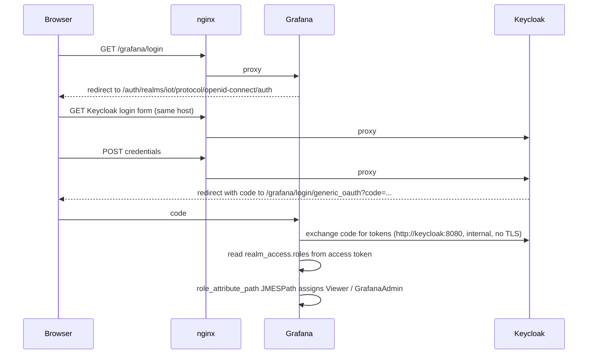

# Grafana

Grafana renders the Prometheus + Postgres data into dashboards and gates
access through Keycloak OIDC. The Prometheus stack is documented separately
in [observability.md](observability.md); this page covers Grafana itself.

## What's wired

- Container `grafana/grafana:11.3.0` on `app-net`, persistent volume
  `grafana_data`.
- Two provisioned datasources: `Prometheus` (default) and `Postgres`
  (read-only via `grafana_read_user`). Both come up from
  `docker/grafana/provisioning/datasources/` on container start; users
  cannot edit them through the UI.
  The Prometheus datasource URL is `http://prometheus:9090/prometheus` — not
  the bare `:9090` root — because Prometheus runs with
  `--web.route-prefix=/prometheus/`, which shifts all API endpoints (including
  the ones Grafana queries) under that prefix.
- Six provisioned dashboards in `docker/grafana/provisioning/dashboards/`:

  | UID             | Title                       | Datasource(s)        | Status                   |
  |-----------------|-----------------------------|----------------------|--------------------------|
  | `system-health` | System Health (Pi host)     | Prometheus           | live                     |
  | `service-health`| Service Health (Zig backend)| Prometheus           | live                     |
  | `lstm`          | LSTM Control Loop           | Prometheus           | live                     |
  | `postgres`      | Postgres (sensor DB)        | Prometheus           | live                     |
  | `sensoren`      | Sensor-Daten (Postgres)     | Postgres             | live                     |
  | `actuator`      | Actuator (controller.py)    | Prometheus           | live                     |

- Keycloak OIDC integration via `GF_AUTH_GENERIC_OAUTH_*` env vars. Realm
  roles map to Grafana roles:

  | Realm role        | Grafana role  |
  |-------------------|---------------|
  | `admin-user`      | `GrafanaAdmin`|
  | anything else     | `Viewer`      |

  Dashboards are provisioned from JSON under `./grafana/provisioning/`, so
  `dashboard-user` end users land as `Viewer`. Only the small admin pool
  (`admin-user`) can edit live, and even those edits should be exported
  back into provisioning JSON to survive a container restart.

  Anonymous access and self-signup are disabled.

## Bootstrap

Grafana needs three secret files before the container will start.

```sh
cd docker/

# Admin user password (used only if OIDC is misconfigured / offline)
openssl rand -base64 32 > secrets/grafana_admin_password.txt

# Keycloak client secret. Value MUST match what is hardcoded as
# "sc_grafana_client" in keycloak/iot-realm.json. The realm import sets
# the client secret to that literal string, and Grafana reads its own
# copy from this file at startup.
#
# WARNING: use `printf`, not `echo`. `echo` appends a trailing newline,
# which Grafana sends verbatim to Keycloak's token endpoint, and Keycloak
# rejects the login with a generic `invalid_client` error. If OIDC login
# fails with no obvious cause, this is the first thing to check.
printf 'sc_grafana_client' > secrets/grafana_oidc_client_secret.txt

# Read-only Postgres password for the Grafana datasource
openssl rand -base64 32 > secrets/db_grafana_password.txt
```

Bring the container up and apply the Postgres password to the new role:

```sh
docker compose up -d grafana
sh ./set_passwords.sh
```

`set_passwords.sh` is idempotent; re-running it after the Grafana addition
just re-applies the `ALTER USER grafana_read_user WITH PASSWORD ...` line
alongside the existing ones.

Grafana is reachable at `https://www.lab.local/grafana/` through nginx.
There is no direct host port for Grafana; all access goes through the
nginx TLS terminator.

## OIDC login flow



`GF_AUTH_GENERIC_OAUTH_AUTH_URL` points at the public hostname because the
browser performs that redirect. `GF_AUTH_GENERIC_OAUTH_TOKEN_URL` and
`GF_AUTH_GENERIC_OAUTH_API_URL` stay on the internal `http://keycloak:8080`
endpoint: those are server-to-server calls that don't need to traverse
nginx or be terminated by TLS, and keeping them internal avoids mounting
the CA cert into Grafana just for this hop.

The redirect URIs in the `grafana-client` Keycloak client list two
patterns so the same realm import works in two contexts:

| Pattern                          | When it matches                                              |
|----------------------------------|--------------------------------------------------------------|
| `https://www.lab.local/*`        | production access through nginx                              |
| `http://localhost:3000/*`        | left in place for emergency direct access if nginx is broken |

Direct access on port 3000 only works if someone temporarily re-adds the
`3000:3000` host port mapping to the grafana service. By default Grafana is
only reachable through nginx.

## How to add a dashboard

1. Build the dashboard in the Grafana UI (`+` → New dashboard).
2. Open it → cog icon → JSON Model. Copy the JSON.
3. Save as `docker/grafana/provisioning/dashboards/<slug>.json`, **strip the
   `id` and `version` fields** at the top (they conflict with provisioning),
   and add a stable `uid` if the export doesn't have one.
4. Commit. The dashboard re-appears automatically; provisioning rescans
   every 30 seconds (`updateIntervalSeconds: 30` in `dashboards.yml`).

The Grafana folder used by all provisioned dashboards is `API-Rpi16GB`.

## Provisioning reload

Dashboard JSON files in `docker/grafana/provisioning/dashboards/` are picked
up automatically — the provisioner rescans every `updateIntervalSeconds`
seconds (30 s in `dashboards.yml`). No container restart is needed for
dashboard changes.

Datasource files in `docker/grafana/provisioning/datasources/` are only read
on container start. To apply a datasource change, restart Grafana:

```sh
docker compose restart grafana
```

## What is intentionally not yet implemented

- **Alerts**. Optional per the Phase 6 spec. Will live in
  `docker/grafana/provisioning/alerting/` when added.

## Verification

The Grafana admin API is reachable from inside the prometheus container
(same `app-net`, same image family with `wget`) without needing to hit it
through nginx. From `docker/` on the Pi:

```sh
ADMIN_PW=$(cat secrets/grafana_admin_password.txt)

# Datasources
docker compose exec prometheus wget -qO- \
  --user=admin --password="$ADMIN_PW" \
  http://grafana:3000/api/datasources

# Dashboards
docker compose exec prometheus wget -qO- \
  --user=admin --password="$ADMIN_PW" \
  http://grafana:3000/api/search?type=dash-db

# Prometheus query through Grafana's proxy
docker compose exec prometheus wget -qO- \
  --user=admin --password="$ADMIN_PW" \
  'http://grafana:3000/api/datasources/proxy/uid/prometheus/api/v1/query?query=up'
```

Expected: six dashboards (`system-health`, `service-health`, `lstm`,
`postgres`, `sensoren`, `actuator`) and two datasources (`Prometheus`,
`Postgres`). The third call should list the scrape targets Prometheus
considers up — six once everything is running (prometheus self, backend,
lstm, controller, postgres_exporter, node_exporter).

For the OIDC flow, open `https://www.lab.local/grafana/` in a browser,
click "Sign in with Keycloak", log in as `iotuser01` (`Test1234!`), and
verify the role shown in the top-right is "Viewer". The `admin-user`
realm role lifts that to "GrafanaAdmin".
