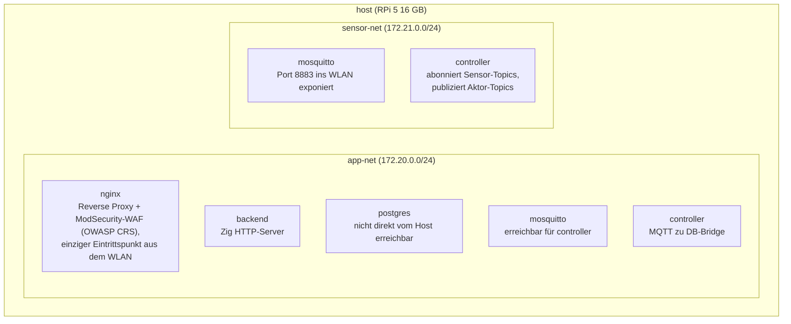
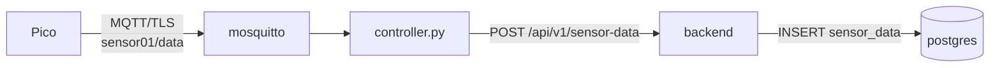
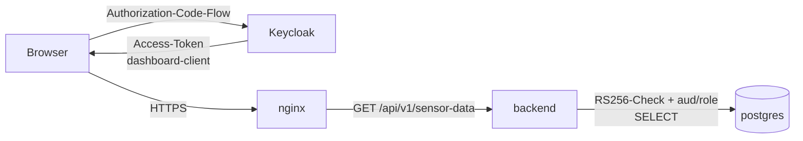
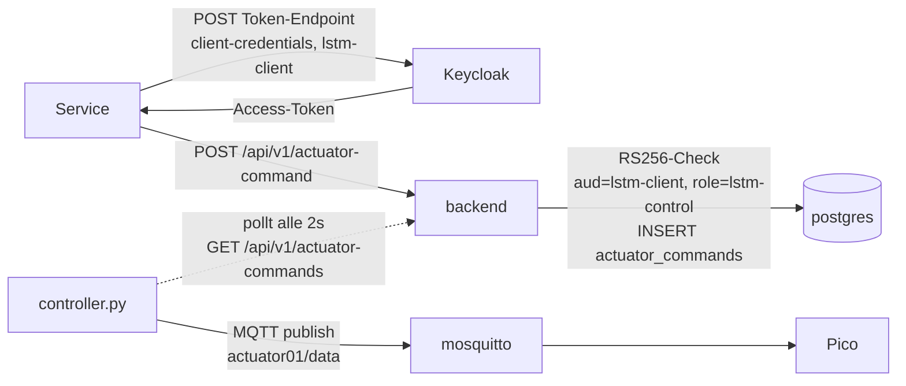

# Backend-Server — Übergabe-Dokumentation

Dieses Dokument beschreibt, was ich auf dem 16-GB-Raspberry-Pi-5 gebaut habe, wie es entstanden ist, wie man es einrichtet, und was noch fehlt.

> **Phase 6 Update.** Dieses Dokument erzählt den Bau-Verlauf bis Phase 4. Phase 6 hat den Stack an mehreren Stellen umgebaut; die einzelnen Schritte unten sind weiterhin historisch korrekt, aber die heutige Wahrheit steht in den fett markierten Verweisen:
>
> - **Auth** ([keycloak-integration.md](keycloak-integration.md), [api.md](api.md)). Die ursprüngliche HS256-JWT-Auth (`/auth/login`, `dashboard_users`-Tabelle, `issueToken`/`validateBearer`, `src/handlers/login.zig`) wurde durch Keycloak (Realm `iot`) ersetzt. Backend prüft RS256-Signaturen gegen das JWKS-Endpoint und gleicht pro Route Audience und Realm-Rolle ab.
> - **Controller** ([controller.md](controller.md)). Der `x-api-key`-Pfad zu `server.js` ist weg. Controller spricht heute direkt mit dem Zig-Backend per Keycloak Client-Credentials (`controller-client`/`controller-ingest`).
> - **server.js raus** ([api.md](api.md)). Der Node-Webserver ist gelöscht; nginx routet nur noch `/api/v1/*` zum Zig-Backend.
> - **LSTM** ([lstm.md](lstm.md)). Eigener Service, Client-Credentials gegen Keycloak (`lstm-client`/`lstm-control`).
> - **Frontend** ([../frontend/frontend.md](../frontend/frontend.md)). Statisches SPA unter `docker/dashboard/`, Keycloak-OIDC im Browser, Backend-Calls mit Bearer Token.
> - **Observability** ([observability.md](observability.md), [grafana.md](grafana.md)). Prometheus + Grafana, OIDC-Login für Grafana, fünf Scrape-Targets, sechs provisionierte Dashboards.
> - **Schemas** (`docker/postgres/init.sql`, `migrate.sql`). Neue Rollen `postgres_exporter_user` + `grafana_read_user`, CHECK-Constraints auf `sensor_id`/`unit`/`command`, `dashboard_users` ist gedroppt.
>
> Die Schritte 6 und 8 unten beschreiben den historischen Phase-4-Stand.

---

## Überblick

Das Projekt baut eine sichere IoT-Infrastruktur nach den Prinzipien Security-by-Design, Zero Trust und Least Privilege (Vorgabe von Prof. Dr. J. Schneider).

Drei Nodes kommunizieren über ein eigenes WLAN (`192.168.50.0/24`, SSID "Production"):

| Node | Hardware | Zuständigkeit |
|------|----------|---------------|
| WLAN-AP | RPi 5 2 GB | WLAN Access Point, Router, nftables-Firewall |
| Backend | RPi 5 16 GB | HTTP API, PostgreSQL, MQTT Broker — dieses Repo |
| MCU | RPi Pico WH | Sensoren/Aktoren, MicroPython |

Der WLAN-AP ist das einzige Gateway. Der Backend-Pi ist über das Internet nicht erreichbar.

---

## Was ich gebaut habe und wie

### Schritt 1 — Grundgerüst (Commit `d4b5db3`)

Erstes Backend-Scaffold: Zig 0.16.0 HTTP-Server, PostgreSQL 16, nginx als Reverse Proxy, alles in Docker mit einem Dockerfile als Multi-Stage-Build. Die Builder-Stage lädt Zig herunter und kompiliert den Source-Code, die Runtime-Stage kopiert nur das fertige Binary plus `libpq5`. Gleichzeitig Docker-Compose-Setup mit zwei Bridge-Netzwerken (`app-net`, `sensor-net`), Datenbankschema (`sensor_data`, `actuator_commands`, `dashboard_users`) und nginx-Config mit Rate Limiting und Subnet-Whitelist.

### Schritt 2 — Docker-Build-Fix für aarch64 (Commit `17ee027`)

Der Zig-Tarball-Name für ARM64 war falsch im Dockerfile — korrigiert auf den richtigen aarch64-Dateinamen für 0.16.0.

### Schritt 3 — WiFi-Problem und erster Setup-Guide (Commits `c0192e7`, `c4c882c`)

**Das größte Einzelproblem:** Der 16-GB-Pi konnte andere Nodes anpingen, war aber selbst nicht pingbar — also von außen nicht erreichbar, obwohl er im Netzwerk war. Habe lange gesucht, bis ich das herausgefunden habe:

Der WLAN-Chip des Pi geht standardmäßig nach ca. 2 Minuten in den Power-Save-Modus. Im Power-Save-Modus verpasst er eingehende Frames, solange er schläft. Ausgehende Verbindungen funktionieren trotzdem, weil der Pi dabei selbst aufwacht. Eingehende Pakete (Ping, SSH, HTTP) kommen aber nicht an.

Lösung: Power-Save dauerhaft deaktivieren über NetworkManager:

```sh
printf '[connection]\nwifi.powersave = 2\n' | sudo tee /etc/NetworkManager/conf.d/wifi-powersave.conf && sudo systemctl reload NetworkManager
```

Referenz: https://raspberrypi.stackexchange.com/questions/4773/raspberry-pi-sleep-mode-how-to-avoid

### Schritt 4 — Datenbank-Integration (Commit `65197d9`)

DB-Verbindung über libpq in Zig eingebaut. Sensor-Handler lesen jetzt echte Daten aus PostgreSQL. DB-Passwörter werden aus `docker/secrets/` gelesen (gitignored, werden einmalig auf dem Pi generiert).

### Schritt 5 — Zig-0.16.0-Breakages fixen (Commits `cce6b8c`, `d8c2afe`, `bed1439`, `5f021ba`)

Zig 0.16.0 hat viele Breaking Changes gegenüber früheren Versionen. Die sind mir beim Kompilieren im Container nacheinander aufgefallen:

- `std.fs.cwd()` und `openFileAbsolute` entfernt → C `fopen` via `@cImport(@cInclude("stdio.h"))`
- `std.mem.trimRight` entfernt → inline als Schleife
- libpq Include-Pfad im Container anders als lokal → `addIncludePath` in `build.zig` plattformabhängig
- `std.ArrayList(T).init(allocator)` entfernt → Fixed Buffer stattdessen

### Schritt 6 — Auth, Login-Handler, Aktor-Handler (untracked: `src/auth.zig`, `src/handlers/login.zig`, `src/handlers/actuator.zig`)

JWT-Implementierung in Zig (HS256, 24h TTL) ohne externe Bibliothek:
- `auth.zig`: Token ausstellen (`issueToken`) und validieren (`validateBearer`), Signatur-Vergleich konstant-zeitig per XOR-Akkumulation
- `login.zig`: `POST /auth/login` — SHA-256-Hash des Passworts gegen `dashboard_users` in der DB prüfen, bei Erfolg JWT zurückgeben
- `actuator.zig`: `POST /api/v1/actuator-command` — Befehl in `actuator_commands` schreiben, `controller.py` holt ihn ab und publiziert ihn per MQTT

### Schritt 7 — Mosquitto und Controller (untracked: `docker/controller/`, `docker/mosquitto/`)

- Mosquitto MQTT Broker mit TLS auf Port 8883, kein Anonymous-Zugang, ACL pro Sensor: `sensor01` darf auf `sensor01/data` schreiben und `actuator01/data` lesen (für den Empfang der Relay-Befehle); `controller` darf `sensor+/data` lesen und `actuator+/data` schreiben
- `controller.py`: abonniert alle Sensor-MQTT-Topics → schreibt in DB; pollt `actuator_commands` alle 2 Sekunden → publiziert per MQTT an die Aktoren, setzt `sent_at`

### Schritt 8 — ModSecurity-WAF + OWASP Core Rule Set (Kap4 4.2)

nginx läuft nicht mehr als plain `nginx:alpine`, sondern als `owasp/modsecurity-crs:nginx-alpine`. Das Image bringt libmodsecurity 3, den ModSecurity-nginx-Konnektor und die OWASP Core Rules mit.

Die alte `docker/nginx/nginx.conf` wurde entfernt, weil das Image eine eigene top-level `nginx.conf` mit dem ModSecurity-Modul-Load mitbringt. Die Projekt-Anpassungen liegen jetzt unter:

- `docker/nginx/templates/conf.d/default.conf.template`: eigener Server-Block (TLS 1.2/1.3, Rate Limiting, Subnet-Whitelist, `/healthz` (Loopback-only, ModSec aus, für den Container-Healthcheck), `/health` `/auth/` `/api/`-Locations, `modsecurity on;`)
- `docker/nginx/modsec/main.conf`: Include-Kette aus Image-Basis-Config, OWASP CRS, eigene Regeln, eigene FP-Exclusions
- `docker/nginx/modsec/custom-rules.conf`: Demo-Regel `id:1000` aus Kap4 4-19 (XSS-Filter auf `REQUEST_URI`)
- `docker/nginx/modsec/exclusions.conf`: Platzhalter für CRS-False-Positive-Exclusions

Die ModSecurity-Direktiven aus Kap4 4-17 (`SecRuleEngine`, `SecRequestBodyAccess`, `SecResponseBodyAccess`, `SecAuditEngine RelevantOnly`, `SecAuditLog /dev/stdout`, `SecAuditLogFormat JSON`) werden per Env-Variablen am nginx-Service gesetzt, das Image befüllt seine `modsecurity.conf` daraus.

**Engine-Modus**: Start in `DetectionOnly`. CRS-Treffer landen im Audit-Log, blockieren aber noch nicht. Nach einer Beobachtungsphase mit echtem Traffic und Tuning der Exclusions wird `MODSEC_RULE_ENGINE` in `docker-compose.yml` auf `On` umgestellt.

**Paranoia-Level**: 1 (CRS-Default).

**Pfad-Abweichung von Folie 4-17**: Die Folie nennt `/etc/nginx/modsecurity/...`. Das OWASP-Image legt die identischen Dateien unter `/etc/modsecurity.d/...` ab. Inhalt, Regelwerk und Audit-Format stimmen mit der Folie überein, nur die Pfade im Container sind anders.

---

## Architektur

### Docker-Netzwerke



`mosquitto` und `controller` sind in beiden Netzwerken. `postgres` ist nur in `app-net` — der Pico kann die DB nie direkt erreichen.

### Datenfluss

**Sensor-Messwert:**


**Dashboard lesen:**


**Aktor-Befehl (LSTM oder Operator):**


### Sicherheitsprinzipien

**Fail-Secure Defaults:**
- nginx gibt 502 zurück wenn der Backend-Container down ist — kein unsicherer Fallback
- Keycloak-Token-Validierung gibt bei fehlendem `Authorization`-Header 401 und bei Signatur-, Issuer-, Audience-, Ablauf- oder Rollen-Fehler 403 zurück. Es gibt keinen Code-Pfad, der eine Anfrage trotz Verifikationsfehler durchlässt.
- MQTT-Broker lehnt die Verbindung bei fehlgeschlagener Auth komplett ab
- DB-Fehler in einem Handler → Fehlerantwort, nie stille Teildaten

**Defence in Depth:**
Sicherheit wird auf mehreren unabhängigen Ebenen durchgesetzt — eine umgangene Schicht reicht nicht aus:
1. nftables auf dem WLAN-AP — nur Production-WLAN-Traffic kommt überhaupt ins Netz
2. nginx Subnet-Whitelist + Rate Limiting — schränkt weiter ein, welche Hosts welche Pfade erreichen
3. Keycloak-Token-Validierung auf jedem `/api/v1/`-Endpunkt inklusive Audience- und Realm-Rollen-Check pro Route — pro Request, nicht pro Session
4. DB-User mit minimalen Rechten — selbst bei vollständiger Kompromittierung des Backend-Prozesses kein DROP/ALTER möglich
5. Docker-Netzwerk-Isolation — Sensor-seitige Container haben keine Route zu postgres
6. MQTT-ACL — kompromittierte Sensor-Credentials können keine anderen Sensor-Daten lesen oder Aktor-Topics beschreiben

**Least Privilege:**
- `iot_write_user`: nur `INSERT`/`SELECT` auf `sensor_data` und `actuator_commands`
- `iot_read_user`: nur `SELECT` auf `sensor_data` und `sensor_data_archive`
- MQTT-ACL: ein Topic pro Sensor, pro Sensor eigene Credentials

**Complete Mediation:**
- nginx prüft jeden eingehenden Request (Rate Limiting, Subnet-Whitelist)
- Keycloak-Token-Validierung auf jedem `/api/v1/`-Endpunkt

**Least Common Mechanism:**
- Jeder Container im eigenen Netzwerksegment
- Zwei DB-User mit verschiedenen Rechten
- Kein Container läuft als root, kein `--privileged`

---

## Einrichtung (erster Start auf dem Pi)

### 1 — SD-Karte flashen

Raspberry Pi Imager (Dev-Rechner):
- Model: Raspberry Pi 5
- OS: Raspberry Pi OS Lite (64-bit)
- Einstellungen: Hostname `backend-server`, SSH aktivieren, Benutzername nicht `pi`/`admin`/`root`, Passwort mit Zahl und Sonderzeichen, Locale Europe/Berlin

### 2 — Erster Boot, System-Update

Pi direkt per Ethernet mit dem Mac verbinden (Internet Sharing am Mac aktivieren):

```sh
ssh <username>@backend-server.local
sudo apt update && sudo apt upgrade -y
```

### 3 — WLAN aktivieren

```sh
sudo iw reg set DE
sudo nmcli radio wifi on
```

### 4 — Mit Production-WLAN verbinden

```sh
sudo nmcli device wifi connect "Production" password "<wlan-passwort>"
sudo nmcli connection modify "Production" connection.autoconnect yes
```

Ab hier läuft alles über das Production-WLAN (`192.168.50.x`).

### 5 — WiFi Power-Save deaktivieren

Ohne diesen Schritt ist der Pi von außen nicht erreichbar (siehe oben).

```sh
printf '[connection]\nwifi.powersave = 2\n' | sudo tee /etc/NetworkManager/conf.d/wifi-powersave.conf && sudo systemctl reload NetworkManager
```

### 6 — Docker installieren

```sh
curl -fsSL https://get.docker.com | sh
sudo usermod -aG docker $USER
```

Aus- und wieder einloggen, dann:

```sh
docker run --rm hello-world
```

### 7 — Repo klonen

```sh
sudo apt install -y git
git clone https://github.com/Just-Martin-Really/API-Rpi16GB.git ~/API-Rpi16GB
```

### 8 — Secrets erzeugen

Passwörter werden nie im Repo gespeichert. Einmalig auf dem Pi generieren:

```sh
mkdir -p ~/API-Rpi16GB/docker/secrets
chmod 700 ~/API-Rpi16GB/docker/secrets

echo "$(openssl rand -base64 24)" > ~/API-Rpi16GB/docker/secrets/db_password.txt
echo "$(openssl rand -base64 24)" > ~/API-Rpi16GB/docker/secrets/db_write_password.txt
echo "$(openssl rand -base64 24)" > ~/API-Rpi16GB/docker/secrets/db_read_password.txt
touch ~/API-Rpi16GB/docker/secrets/keycloak_lstm_secret.txt
touch ~/API-Rpi16GB/docker/secrets/keycloak_controller_secret.txt
echo "controller"                 > ~/API-Rpi16GB/docker/secrets/mqtt_controller_user.txt
echo "$(openssl rand -base64 24)" > ~/API-Rpi16GB/docker/secrets/mqtt_controller_password.txt

chmod 600 ~/API-Rpi16GB/docker/secrets/*.txt
```

### 9 — TLS-Zertifikate erzeugen

Erzeugt eine lokale CA, signiert ein Zertifikat für nginx (`www.lab.local`) und eines für den MQTT Broker:

```sh
cd ~/API-Rpi16GB
sudo sh docker/setup_tls.sh
```

Das CA-Zertifikat muss danach auf den Pico und in jeden Browser kopiert werden, der das Dashboard öffnen soll.

### 10 — Host-Firewall

SSH nur aus dem Production-WLAN erlauben:

```sh
sudo iptables -A INPUT -p tcp --dport 22 -s 192.168.50.0/24 -j ACCEPT
sudo iptables -A INPUT -p tcp --dport 22 -j DROP
sudo apt install iptables-persistent -y
sudo netfilter-persistent save
```

### 11 — Stack starten

```sh
cd ~/API-Rpi16GB/docker
docker compose up --build -d
```

Beim ersten Mal dauert das mehrere Minuten (Zig ~90 MB herunterladen, kompilieren, Images bauen). Danach DB- und MQTT-Passwörter setzen:

```sh
sh set_passwords.sh
```

Prüfen:

```sh
docker compose ps
curl -k https://192.168.50.<backend-ip>/health
# → {"status":"ok"}
```

---

## Updates einspielen

```sh
cd ~/API-Rpi16GB && git pull
cd docker && docker compose up --build -d --no-deps backend
```

`--no-deps` baut nur den Backend-Container neu, ohne postgres oder nginx anzufassen.

---

## WAF-Management

**Audit-Log live ansehen (JSON):**

```sh
docker compose logs -f nginx | grep -oE '\{.*\}' | jq 'select(.transaction)'
```

**Vom Detection- in den Blocking-Modus umschalten** (nach FP-Tuning):

In `docker/docker-compose.yml` am nginx-Service:

```yaml
MODSEC_RULE_ENGINE: On   # vorher: DetectionOnly
```

Dann:

```sh
cd ~/API-Rpi16GB/docker && docker compose up -d --no-deps nginx
```

**False-Positive-Exclusion hinzufügen**: Regel-ID aus dem Audit-Log lesen, dann in `docker/nginx/modsec/exclusions.conf`:

```
SecRuleRemoveById 942100
```

Jeder Eintrag braucht im Kommentar die Regel-ID, den Pfad und den legitimen Request, der gefeuert hat.

**Demo: Angriff testen**, Regel `id:1000` feuert auf `<script>` in der URI:

```sh
curl -k 'https://backend-server.local/api/v1/sensor-data?x=<script>'
# DetectionOnly: 200 + Audit-Log-Eintrag
# On:           403 Forbidden + Audit-Log-Eintrag
```

---

## API

Basis-URL: `https://www.lab.local`

Alle `/api/v1/`-Endpunkte brauchen `Authorization: Bearer <token>` mit einem RS256-Access-Token aus Keycloak (Realm `iot`). Pro Route gilt zusätzlich eine Audience- und Realm-Rollen-Policy — siehe [api.md](api.md) für die komplette Matrix. Tokens werden direkt bei Keycloak geholt (Dashboard via Authorization-Code-Flow, LSTM und Controller via Client-Credentials-Flow); das Backend stellt selbst keine Tokens aus.

### GET /health

Kein Auth nötig. Antwort 200: `{"status": "ok"}`

### GET /api/v1/sensor-data

Audience `dashboard-client`, Rolle `dashboard-user`. Optional `?from=<iso>&to=<iso>` für Zeitraum-Filterung.

```json
[{ "id": 1, "sensor_id": "sensor01", "value": 23.4, "unit": "°C", "recorded_at": "2026-04-24T10:00:00Z" }]
```

### POST /api/v1/sensor-data

Audience `controller-client`, Rolle `controller-ingest`.

```json
{ "sensor_id": "sensor01", "value": 23.4, "unit": "°C" }
```

Antwort 201: `{"created": true}`

### POST /api/v1/actuator-command

Audience `lstm-client`, Rolle `lstm-control`.

```json
{ "actuator_id": "actuator01", "command": "on", "issued_by": "machine" }
```

Antwort 201: `{"queued": true}` — controller.py liefert den Befehl innerhalb ~2s per MQTT

---

## Datenbankschema

```sql
CREATE TABLE sensor_data (
    id          BIGSERIAL        PRIMARY KEY,
    sensor_id   VARCHAR(64)      NOT NULL,
    value       DOUBLE PRECISION NOT NULL,
    unit        VARCHAR(16)      NOT NULL,
    recorded_at TIMESTAMPTZ      NOT NULL DEFAULT NOW()
);

CREATE TABLE actuator_commands (
    id          BIGSERIAL    PRIMARY KEY,
    actuator_id VARCHAR(64)  NOT NULL,
    command     VARCHAR(64)  NOT NULL,
    issued_by   VARCHAR(16)  NOT NULL DEFAULT 'user',  -- 'user' | 'machine'
    issued_at   TIMESTAMPTZ  NOT NULL DEFAULT NOW(),
    sent_at     TIMESTAMPTZ           -- NULL bis controller.py den Befehl abgesendet hat
);
```

Die Tabelle `dashboard_users` aus Phase 4 ist seit Phase 6 entfernt; Benutzeridentität lebt vollständig in Keycloak. `docker/postgres/migrate.sql` enthält `DROP TABLE IF EXISTS dashboard_users` für den Live-Pi.
