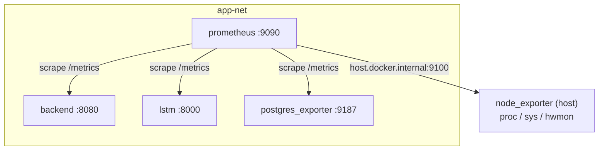

# Observability: Prometheus Stack

Prometheus scrapes metrics from every service in the stack. Grafana is the
next step and is not part of this page; this document covers what is exposed,
how it is wired, and how to verify it works.

## Stack

| Service           | Image                                                | Network                | Port  | Purpose                                       |
|-------------------|------------------------------------------------------|------------------------|-------|-----------------------------------------------|
| `prometheus`      | `prom/prometheus:v2.55.1`                            | `app-net`              | 9090  | scrape + TSDB                                 |
| `node_exporter`   | `quay.io/prometheus/node-exporter:v1.8.2`            | host (`network_mode`)  | 9100  | Pi-level CPU, RAM, disk, temperature          |
| `postgres_exporter` | `quay.io/prometheuscommunity/postgres-exporter:v0.15.0` | `app-net`           | 9187  | sensor-DB connections, transactions, sizes    |
| Zig backend       | (in-tree)                                            | `app-net`              | 8080  | `/metrics` route, hand-rolled exposition      |
| LSTM control loop | (in-tree)                                            | `app-net`              | 8000  | `prometheus_client.start_http_server`         |
| `controller`      | (in-tree)                                            | `app-net`              | 8000  | actuator-command dispatcher metrics           |

Prometheus listens on `:9090` inside `app-net` only. There is no host-port
mapping. Prometheus is accessible externally at
`https://www.lab.local/prometheus/` through the nginx reverse proxy. The
container is started with `--web.external-url=https://www.lab.local/prometheus/`
and `--web.route-prefix=/prometheus/`, which shifts all routes — including
`/api/v1/` and `/metrics` — under the `/prometheus/` prefix.

## Scrape topology



Targets are configured statically in `docker/prometheus/prometheus.yml`. No
service discovery — every target is a known Docker hostname plus a fixed
port, which keeps the config diffable and reviewable.

## Per-service metrics

### Zig backend (`backend:8080/metrics`)

The Zig stdlib has no Prometheus library. Rather than pull a third-party HTTP
+ JSON dependency in, the backend renders the [Prometheus text exposition
format](https://prometheus.io/docs/instrumenting/exposition_formats/) by hand
out of an atomic counter array in `src/metrics.zig`. Every route the router
knows about has a dedicated slot, plus an `unknown` bucket for 404 paths, so
a stray scanner cannot grow memory by hitting random URLs.

The `/metrics` endpoint is unauthenticated by design. Prometheus has no JWT
client, and the route is reachable only on `app-net`; nginx never proxies it.

Instrumentation is centralised in `src/server.zig`: a per-request `defer`
classifies the route with `router.routeFor`, captures monotonic timestamps
via `std.Io.Clock.now(.awake, io)`, and calls `Registry.observe` after the
handler returns. Counters and bucket counts use `std.atomic.Value(u64)` with
`.monotonic` ordering, so observe and render never block each other.

| Metric                                            | Type      | Labels                  |
|---------------------------------------------------|-----------|-------------------------|
| `backend_http_requests_total`                     | counter   | `method`, `route`       |
| `backend_http_request_duration_seconds`           | histogram | `method`, `route`, `le` |
| `backend_process_start_time_seconds`              | gauge     | none                    |

The histogram uses the Prometheus client-library default web latency buckets
(`0.005s` through `10s`) so Grafana panels stay portable.

### LSTM control loop (`lstm:8000/metrics`)

The LSTM is a daemon loop, not an HTTP service. Rather than push to a
Pushgateway (anti-pattern for long-running jobs — dead loops leave zombie
values), `prometheus_client.start_http_server(METRICS_PORT)` spins up a
daemon thread that serves the default registry on port 8000. The container
already lives on `app-net`, so Prometheus reaches it via DNS.

| Metric                              | Type      | Labels             | Meaning                                            |
|-------------------------------------|-----------|--------------------|----------------------------------------------------|
| `lstm_iterations_total`             | counter   | `outcome`          | iterations by `ok` / `error`                       |
| `lstm_inference_duration_seconds`   | histogram | none               | wall-clock time spent inside `forecast()`          |
| `lstm_predictions_total`            | counter   | none               | forecast points emitted (LOOKAHEAD per iteration)  |
| `lstm_last_prediction_celsius`      | gauge     | none               | most recent forecast peak (max over LOOKAHEAD)     |
| `lstm_commands_sent_total`          | counter   | `role`, `command`  | actuator commands dispatched by role and command   |

Plus the default `process_*` and `python_gc_*` collectors that
`prometheus_client` ships.

When the loop runs in `--once` mode the metrics port is not opened — that
flag exists for cron / smoke tests where an HTTP server would just leak a
port.

### Postgres exporter (`postgres_exporter:9187`)

Connects as `postgres_exporter_user`, a read-only monitoring role with the
canonical `pg_monitor` grant. This role is **not** created by `init.sql` and
must be bootstrapped manually before the exporter will connect — see
[Bootstrap](#bootstrap). The `pg_monitor` grant gives access to the
`pg_stat_*` views without exposing row data.

Notable metrics out of the box:

- `pg_up` — 1 if the exporter could connect, 0 otherwise. Use this as the
  liveness signal in dashboards.
- `pg_stat_database_xact_commit`, `pg_stat_database_xact_rollback` —
  transaction throughput per database.
- `pg_stat_database_numbackends` — open connections per database; useful for
  spotting connection-pool leaks in the Zig backend.
- `pg_database_size_bytes` — total disk usage per database. Watch this for
  the sensor DB once the archiver runs in production.
- `pg_stat_user_tables_n_live_tup` / `n_dead_tup` — row counts and VACUUM
  pressure on `sensor_data`, `actuator_commands`, etc.

The full list is documented at
[https://github.com/prometheus-community/postgres_exporter](https://github.com/prometheus-community/postgres_exporter).

### node_exporter (host network, `host.docker.internal:9100`)

Runs in the host network namespace with `/proc`, `/sys`, and `/` bind-mounted
read-only. That way CPU temperature, disk usage, and memory pressure all
report the Pi's real values rather than container-scoped ones.

Prometheus reaches it via `host.docker.internal:9100`, which resolves to the
host gateway thanks to `extra_hosts: ["host.docker.internal:host-gateway"]`
on the prometheus service.

Useful metrics for Pi monitoring:

- `node_cpu_seconds_total{mode="user|system|iowait|idle"}` — derive CPU usage
  by differentiating user+system over time.
- `node_memory_MemAvailable_bytes` — free memory the kernel can reclaim
  without swapping; better signal than `MemFree`.
- `node_filesystem_avail_bytes{mountpoint="/"}` — root filesystem headroom.
- `node_thermal_zone_temp{type="cpu-thermal"}` — SoC temperature on the
  Pi. The `hwmon` collector does not publish a useful value on
  Raspberry Pi; the thermal-zone path under `/sys/class/thermal/` is
  the canonical source. Useful for catching thermal throttling before
  `vcgencmd get_throttled` flips.
- `node_load1`, `node_load5`, `node_load15` — load average; matches the
  numbers the boot-hang watchdog logged on the previous incident.

## Bootstrap

Prometheus brings up cleanly with `docker compose up -d prometheus
node_exporter postgres_exporter`. Two manual steps are required: generating
the exporter password secret and creating the Postgres monitoring role.

**Step 1 — generate the password secret:**

```sh
echo "$(openssl rand -base64 32)" > docker/secrets/db_exporter_password.txt
```

That file is mounted into `postgres_exporter` as
`/run/secrets/db_exporter_password` and read via `DATA_SOURCE_PASS_FILE`.

**Step 2 — create the monitoring role** (`postgres_exporter_user` is not
created by `init.sql`; this must be run once per environment):

```sh
EXPORTER_PW=$(cat docker/secrets/db_exporter_password.txt)
docker compose exec postgres psql -U postgres \
  -c "CREATE USER postgres_exporter_user WITH PASSWORD '$EXPORTER_PW';"
docker compose exec postgres psql -U postgres \
  -c "GRANT pg_monitor TO postgres_exporter_user;"
docker compose exec postgres psql -U postgres -d sensor \
  -c "GRANT CONNECT ON DATABASE sensor TO postgres_exporter_user;"
```

`docker/set_passwords.sh` contains only an `ALTER USER … PASSWORD` line and
cannot create the role. Run the three SQL commands above on first setup, then
use `set_passwords.sh` for subsequent password rotations.

The exporter will report `pg_up 0` until the role exists with the correct
password.

## Verification

All commands run from `docker/` on the Pi.

### Prometheus targets are up

```sh
docker compose exec prometheus wget -qO- http://localhost:9090/prometheus/api/v1/targets | jq '.data.activeTargets[] | {job:.labels.job, health:.health}'
```

Every entry should show `"health": "up"` once the services have been running
for one scrape interval (15s).

### Zig backend `/metrics`

The backend runtime image is debian-slim without curl or wget, so the scrape
test runs from inside the prometheus container, which uses the same
`app-net` and ships busybox wget.

```sh
docker compose exec prometheus wget -qO- http://backend:8080/metrics | head -40
```

Expected output begins with:

```
# HELP backend_http_requests_total Total HTTP requests handled by the backend.
# TYPE backend_http_requests_total counter
backend_http_requests_total{method="GET",route="/health"} 0
```

### LSTM `/metrics`

```sh
docker compose exec prometheus wget -qO- http://lstm:8000/metrics | grep lstm_
```

Expected output includes `lstm_iterations_total`,
`lstm_inference_duration_seconds_*`, and `lstm_last_prediction_celsius`. The
last two are only populated once the loop has run at least one iteration,
which takes up to `LOOP_SECONDS` (60s by default).

### Postgres exporter

```sh
docker compose exec prometheus wget -qO- http://postgres_exporter:9187/metrics | grep -E '^pg_up|^pg_stat_database_numbackends'
```

`pg_up 1` confirms the connection. `pg_stat_database_numbackends` exposes a
row per database.

### node_exporter (host)

```sh
curl -s http://localhost:9100/metrics | grep -E '^node_thermal_zone_temp|^node_load1 '
```

Run this on the Pi itself, not inside a container — node_exporter is on the
host network namespace.

## What this stack does not include yet

- **Alerts.** Optional per the Phase 6 spec. Will live in
  `docker/prometheus/alert.rules.yml` alongside `prometheus.yml` when added.

## Configuration reload

### Prometheus

Reload the scrape configuration without restarting the container by sending
SIGHUP to PID 1 inside the container:

```sh
docker compose exec prometheus kill -HUP 1
```

Prometheus logs `"Completed loading of configuration file"` on success. The
TSDB is not restarted; only the scrape config and rule files are re-read.

### nginx

nginx templates (`docker/nginx/templates/conf.d/*.conf.template`) are rendered
into the running config only when the container starts. A plain `restart` is
not sufficient after a template change — the container must be force-recreated
so that environment-variable substitution runs again:

```sh
docker compose up -d --force-recreate --no-deps nginx
```

## Design notes

A few choices that were not obvious from the ticket.

- **No Pushgateway for the LSTM.** Pushgateway is documented as an
  anti-pattern for long-running services because it does not expire stale
  metrics; a crashed loop would leave zombie counters in Prometheus
  forever. A `prometheus_client.start_http_server` thread costs effectively
  nothing on a Pi 5 with 16 GB RAM and gives correct scrape-once-and-done
  semantics.
- **Hand-rolled exposition in Zig.** Adding a metrics library would have
  meant a full HTTP-client + JSON dependency tree behind a single text
  endpoint. The exposition format is small enough — a dozen lines per
  histogram — that writing it by hand is cheaper than vendoring.
- **node_exporter on the host network namespace.** Running node_exporter in
  the default bridge would report container values for `/proc`, `/sys`, and
  the hwmon temperature sensor, which would defeat the purpose of host
  monitoring. The trade-off is one extra `extra_hosts` line on the
  prometheus service so the scrape target resolves.
- **Postgres exporter uses `pg_monitor`, not a custom grant list.**
  `pg_monitor` is the canonical role for monitoring tools and is forward-
  compatible with new `pg_stat_*` views as Postgres versions move. Hand-
  rolling SELECT grants would break silently on the next major upgrade.
- **Atomic counters, no mutex.** With one thread per TCP connection, lock
  contention on a scrape every 15s would be invisible — but the atomic
  primitives are simpler than threading `Io` through every observe() call
  in Zig 0.16's API.
