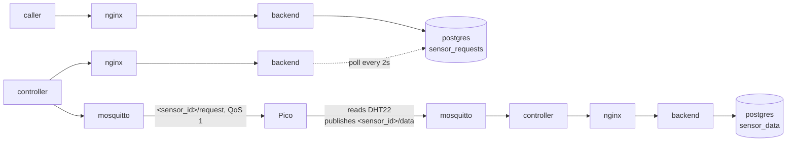

# Sensor Request Flow

Describes how a sensor data request (e.g. an emergency "read now") travels from a caller (dashboard, watchdog, operator script) to the Pico and back.

## Overview



The request path mirrors the actuator command flow: the caller inserts a row into `sensor_requests` and returns immediately, the controller drains pending rows on its 2s tick and publishes them over MQTT. The Pico is responsible for the response leg, which reuses the existing sensor data path.

## Public endpoint

`POST /api/v1/sensor-request` is documented in the [API Reference](api.md#post-apiv1sensor-request). Authenticated with a dashboard JWT (audience `dashboard-client`, role `dashboard-user`). Inserts one row into `sensor_requests` with `sent_at = NULL`.

## Controller drain endpoints

Both routes are served by the Zig backend (`src/handlers/sensor_request.zig`, routed in `src/router.zig`). Authentication is a Keycloak access token whose audience is `controller-client` and whose realm role is `controller-ingest`.

### GET /api/v1/sensor-requests

Returns up to 100 pending requests, oldest first.

**Response 200**
```json
{
  "requests": [
    { "id": 7, "sensor_id": "sensor01", "command": "READ_NOW" }
  ]
}
```

### POST /api/v1/sensor-requests/sent

Marks one request as sent. Idempotent: subsequent calls for the same id return `{"updated": 0}` because the SQL also checks `sent_at IS NULL`.

**Request body**
```json
{ "id": 7 }
```

**Response 200**
```json
{ "updated": 1 }
```

**Response 400** when `id` is missing, not an integer, or non-positive.

## Controller loop

`docker/controller/controller.py` runs `drain_sensor_requests` alongside `drain_actuator_commands` on the same 2 second tick:

1. `GET /api/v1/sensor-requests` (HTTPS, `Authorization: Bearer <token>`).
2. For each row:
    1. Validate `sensor_id` against `^[A-Za-z0-9_-]+$` and `command` against `^[A-Z0-9_]+$`. Rejected rows are marked sent without publishing, so a malicious authenticated caller cannot inject MQTT topics via DB content.
    2. Publish `{"command": "<command>"}` to `<sensor_id>/request` at QoS 1 and wait up to 5 s for the broker ack.
    3. On successful publish, `POST /api/v1/sensor-requests/sent` to mark the row.
3. Sleep `ACTUATOR_POLL_SECONDS` (2 s) and repeat.

The bearer token is shared with the actuator drain (one cached token per controller process, refreshed before expiry).

The poll constant is shared with the actuator drain by design: one tick, both queues. Tuning it changes the worst-case latency for both flows in lockstep.

Errors at any step are logged and the loop continues. The row stays unsent and is retried on the next poll.

## Pico behaviour

The Pico subscribes to two topics: `actuator01/data` (existing) and `sensor01/request` (new). The MQTT callback inspects the payload's `command` field and dispatches:

* `HEAT_ON`, `HEAT_OFF`, `FAN_ON`, `FAN_OFF` flip the corresponding GPIO via `switch_heat` / `switch_fan` (actuator path).
* `READ_NOW` sets a module flag `read_now_requested = True`.

The main loop checks the flag after each `mqtt.check_msg()`. If set, it calls `publish_reading(mqtt)` and clears the flag. Doing the actual sensor read and publish from the main loop (rather than from inside the callback) keeps the umqtt receive path simple and avoids re-entering the MQTT library while it is mid-read.

Note: `READ_NOW` does **not** reset the regular 60 s publish cadence. If a request arrives one second before the periodic publish, the Pico publishes twice in a row. This is fine for correctness because every reading is independent.

## Delivery semantics

At-least-once on the request leg, same as the actuator path. If the controller crashes between a successful publish and the mark-sent POST, the next poll republishes the same row. The Pico handler is idempotent (each `READ_NOW` triggers exactly one extra publish), so duplicate delivery is safe.

The response leg uses the existing sensor data flow, which already has its own freshness and range checks in `controller.on_message`.

Worst-case end-to-end latency: poll interval (2 s) plus publish round-trip plus Pico loop tick (0.2 s) plus sensor read (~50 ms) plus return publish. Typically the caller sees a fresh `sensor_data` row within 3 to 4 seconds.

## Emergency shutdown pattern

A watchdog process or the dashboard can combine the request and actuator paths to implement an emergency shutdown when sensor data goes stale:

1. Notice that the newest `sensor_data` row for `sensor01` is older than the expected 60 s cadence by a meaningful margin (e.g. 90 s).
2. `POST /api/v1/sensor-request {"sensor_id":"sensor01","command":"READ_NOW"}` to force a read.
3. Wait a few seconds for a new `sensor_data` row.
4. If still no fresh row, conclude that the Pico or the link is dead and `POST /api/v1/actuator-command {"actuator_id":"actuator01","command":"HEAT_OFF"}` followed by `FAN_OFF`.

The watchdog itself is not part of this change. The new endpoint and topic only provide the request primitive that such a watchdog needs.

## Database schema

```sql
CREATE TABLE sensor_requests (
    id          BIGSERIAL    PRIMARY KEY,
    sensor_id   VARCHAR(64)  NOT NULL,
    command     VARCHAR(64)  NOT NULL,
    issued_at   TIMESTAMPTZ  NOT NULL DEFAULT NOW(),
    sent_at     TIMESTAMPTZ
);

CREATE INDEX idx_sensor_requests_unsent
    ON sensor_requests (issued_at)
    WHERE sent_at IS NULL;
```

Grants: `iot_write_user` holds `INSERT, SELECT, UPDATE`. The Zig backend uses this role for both the issuing path (`POST /api/v1/sensor-request`) and the drain path (`GET` / `POST /sent`). No other service touches the table.

A migration block in `docker/postgres/migrate.sql` covers existing deployments where the initial schema has already been applied.

## MQTT ACL

`docker/mosquitto/acl` is extended so that `sensor01` may read `sensor01/request` and `controller` may write it. Existing topics (`sensor01/data`, `actuator01/data`) are unchanged.

## Troubleshooting

| Symptom | Likely cause |
|---------|--------------|
| `sensor-request drain error: Connection refused` in controller logs | `API_BASE_URL` is wrong or nginx is down |
| `sensor-request drain error: HTTP Error 401` | Token expired or revoked mid-flight; the controller refreshes and retries once. Persistent 401 means the Keycloak client secret in `/run/secrets/keycloak_controller_secret` does not match `controller-client` in the realm |
| `sensor-request drain error: HTTP Error 403` | Token is valid but missing the `controller-ingest` realm role on the `controller-client` service account, or audience does not match |
| `sensor-request publish failed: id=N` | Mosquitto unreachable or the publish ack timed out; row stays unsent for the next poll |
| `sensor-request skipped invalid row id=N` | The row's `sensor_id` or `command` failed the regex check; row was marked sent without publishing |
| Row stays with `sent_at = NULL` and no log line | Controller is not running, or it cannot reach the backend at all |
| Row is marked sent but no fresh `sensor_data` row appears | Pico is not subscribed (check ACL + broker logs), or the DHT22 read failed (check Pico console for `Sensor-Fehler`) |
